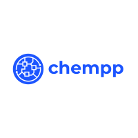

<!--
*** Thanks for checking out the Best-README-Template. If you have a suggestion
*** that would make this better, please fork the repo and create a pull request
*** or simply open an issue with the tag "enhancement".
*** Thanks again! Now go create something AMAZING! :D
***
***
***
*** To avoid retyping too much info. Do a search and replace for the following:
*** michelml, chempp, twitter_handle, michmoreau.l@gmail.com, chempp, project_description
-->


<!-- PROJECT SHIELDS -->
<!--
*** I'm using markdown "reference style" links for readability.
*** Reference links are enclosed in brackets [ ] instead of parentheses ( ).
*** See the bottom of this document for the declaration of the reference variables
*** for contributors-url, forks-url, etc. This is an optional, concise syntax you may use.
*** https://www.markdownguide.org/basic-syntax/#reference-style-links
-->
[![Contributors][contributors-shield]][contributors-url]
[![Forks][forks-shield]][forks-url]
[![Stargazers][stars-shield]][stars-url]
[![Issues][issues-shield]][issues-url]
[![Apache License][license-shield]][license-url]
[![LinkedIn][linkedin-shield]][linkedin-url]

<br />
<p align="center">
  <a href="https://github.com/michelml/chempp">
    
  </a>

  <p align="center">
    [Large scale] concurrent chemical search engine using RDKit cartridge, Oat++ and native Postgres & C++ features.
    <br />
    <a href="https://github.com/michelml/chempp"><strong>Explore the docs »</strong></a>
    <br />
    <br />
    <a href="https://github.com/michelml/chempp">View Demo</a>
    ·
    <a href="https://github.com/michelml/chempp/issues">Report Bug</a>
    ·
    <a href="https://github.com/michelml/chempp/issues">Request Feature</a>
  </p>
</p>


<!-- TABLE OF CONTENTS -->
<details open="open">
  <summary><h2 style="display: inline-block">Table of Contents</h2></summary>
  <ol>
    <li>
      <a href="#about-the-project">About The Project</a>
      <ul>
        <li><a href="#built-with">Built With</a></li>
      </ul>
    </li>
    <li>
      <a href="#getting-started">Getting Started</a>
      <ul>
        <li><a href="#prerequisites">Prerequisites</a></li>
        <li><a href="#installation">Installation</a></li>
      </ul>
    </li>
    <li><a href="#usage">Usage</a></li>
    <li><a href="#roadmap">Roadmap</a></li>
    <li><a href="#contributing">Contributing</a></li>
    <li><a href="#license">License</a></li>
    <li><a href="#contact">Contact</a></li>
    <li><a href="#acknowledgements">Acknowledgements</a></li>
  </ol>
</details>


<!-- ABOUT THE PROJECT -->
## About The Project

**chempp** [kem-pee-pee], is a large scale concurrent chemical search engine using RDKit cartridge, Oat++ and native Postgres & C++ features.

This is my capstone project for the C++ nanodegree https://www.udacity.com/course/c-plus-plus-nanodegree--nd213 .

### Built With

* [OAT++](https://oatpp.io/)
* [PostgreSQL RDKit cartridge](https://rdkit.org/docs/Cartridge.html)
* [PostgreSQL](https://www.postgresql.org/)
* Special mention to Arthur Farias for his very well crafted [url encoding/decoding C++ gist](https://gist.github.com/arthurafarias/56fec2cd49a32f374c02d1df2b6c350f)

## Getting Started

Start the db and service (this will build the images if not done already):

```bash
docker-compose up
```

In another terminal window, fill the db with the compounds, this must be done once the `db` service is up and running.

```bash
sudo docker-compose exec db bash -c "/utility/populate_db.sh"
```

> **Warning:** This command will take a while because it inserts ~3M rows in the db and [creates indexes to perform efficient searches](https://rdkit.org/docs/Cartridge.html), a rough estimate being between 15 minutes and an hour.

Once these two commands are ran, you are ready to test the endpoints at http://localhost:8000/swagger/ui .

### Prerequisites

- [Git](https://git-scm.com/)
- [Docker and Docker-Compose](https://www.docker.com/)

### Installation

Everything is done through docker and docker-compose. See <a href="#getting-started">Getting Started</a> section.

<!-- USAGE EXAMPLES -->
## Usage

TBD

<!-- ROADMAP -->
## Roadmap

See the [open issues](https://github.com/michelml/chempp/issues) for a list of proposed features (and known issues).

<!-- CONTRIBUTING -->
## Contributing

Contributions are what make the open source community such an amazing place to be learn, inspire, and create. Any contributions you make are **greatly appreciated**.

1. Fork the Project
2. Create your Feature Branch (`git checkout -b feature/AmazingFeature`)
3. Commit your Changes (`git commit -m 'Add some AmazingFeature'`)
4. Push to the Branch (`git push origin feature/AmazingFeature`)
5. Open a Pull Request

<!-- LICENSE -->
## License

Distributed under the Apache-2.0 License. See `LICENSE` for more information.


<!-- CONTACT -->
## Contact

Michel ML - [@michelml](https://github.com/MichelML) - michmoreau.l@gmail.com

Project Link: [https://github.com/michelml/chempp](https://github.com/michelml/chempp)

<!-- ACKNOWLEDGEMENTS -->
## Acknowledgements

Thank you to all contributors of libraries and tools used in this project.

<!-- MARKDOWN LINKS & IMAGES -->
<!-- https://www.markdownguide.org/basic-syntax/#reference-style-links -->
[contributors-shield]: https://img.shields.io/github/contributors/michelml/chempp.svg?style=for-the-badge
[contributors-url]: https://github.com/michelml/chempp/graphs/contributors
[forks-shield]: https://img.shields.io/github/forks/michelml/chempp.svg?style=for-the-badge
[forks-url]: https://github.com/michelml/chempp/network/members
[stars-shield]: https://img.shields.io/github/stars/michelml/chempp.svg?style=for-the-badge
[stars-url]: https://github.com/michelml/chempp/stargazers
[issues-shield]: https://img.shields.io/github/issues/michelml/chempp.svg?style=for-the-badge
[issues-url]: https://github.com/michelml/chempp/issues
[license-shield]: https://img.shields.io/github/license/michelml/chempp.svg?style=for-the-badge
[license-url]: https://github.com/michelml/chempp/blob/master/LICENSE.txt
[linkedin-shield]: https://img.shields.io/badge/-LinkedIn-black.svg?style=for-the-badge&logo=linkedin&colorB=555
[linkedin-url]: https://www.linkedin.com/in/michelmoreau1/
[product-screenshot]: chempp.png
